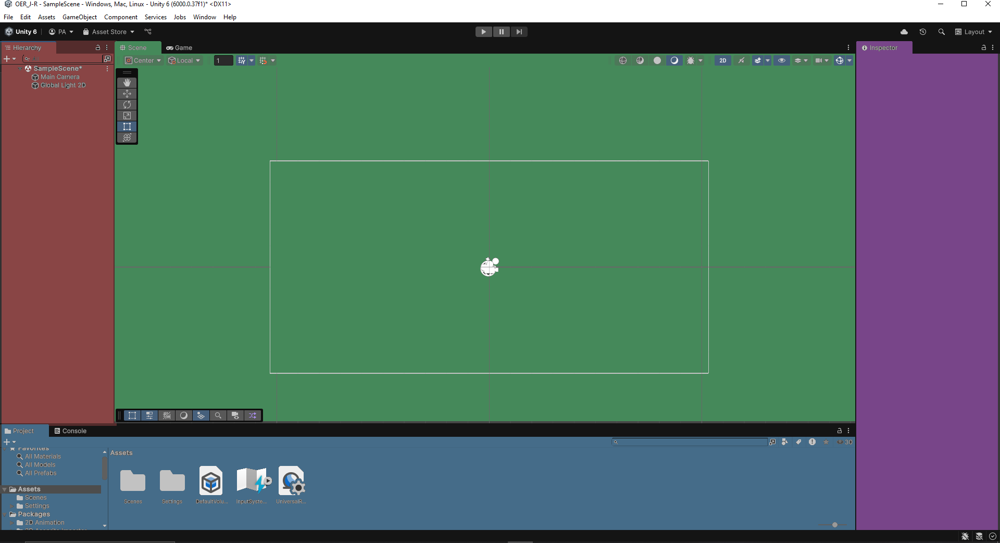
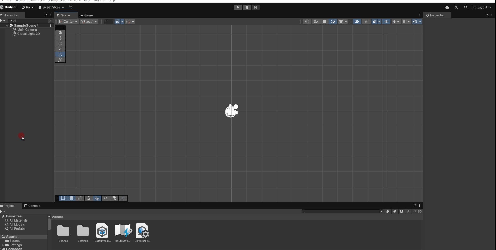
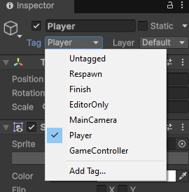
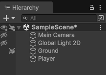
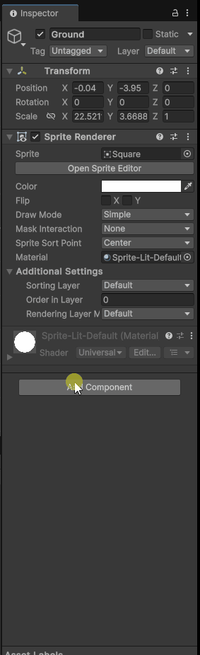

# OER - OERIA
## Einleitung
OERIA ist ein Jump&Run Projekt das im Rahmen einer OER Einführung in Unity entstanden ist. In diesem Dokument werden die einzelenen Schritte erläutert für die Erstellung eines 2D Jump&Run.  

Dabei werden Themen wir Scenenerstellung, Objektplazierung, Kamera und Steuerung angesprochen.

## Inhaltsverzeichniss
- [OER - OERIA](#oer---oeria)
  - [Einleitung](#einleitung)
  - [Inhaltsverzeichniss](#inhaltsverzeichniss)
  - [Kapitel 1 - Installation von Unity und Projekt Erstellung](#kapitel-1---installation-von-unity-und-projekt-erstellung)
  - [Kapitel 2 - Unity Editor: Übersicht](#kapitel-2---unity-editor-übersicht)
  - [Kapitel 3 - Unity Editor: Erste Schritte](#kapitel-3---unity-editor-erste-schritte)
  - [Kapitel 4 - Unity Editor: Physics](#kapitel-4---unity-editor-physics)
  - 
## Kapitel 1 - Installation von Unity und Projekt Erstellung
Unity kann auf der [Webseite](https://unity.com/de) heruntergeladen werden. Die Installation erklärt sich von selbst.

Am Ende der Installation finden wir uns mit dem Unity Hub konfrontiert.

Hier erstellen wir unter **Projects** ein **New Project**  
Wir bennenen das Projekt Projekt und setzen den Speicherort fest.  
Mit **Create Projekt** erstellt Unity das Projekt.

## Kapitel 2 - Unity Editor: Übersicht
Willkommen im Unity Editor!

Ist in mehrere Abschnitte unterteilt wir schauen uns jeden Abschnitt kurz an und erklären dir was die Aufgabe des Abschnitts ist.
Um die Erklärung zu vereinfachen haben wir die Abschnitte farblich hinterlegt.

  
 <b>Scene:</b> 
  Das ist unsere Scenen, unsere Hauptansicht. Hier werden Objekte positioniert und 
  ist im Grunde unser "Level Editor".
  

  
 <b>Hierachy:</b> 
  Ist eine Allgemeiner Übersicht über alle Objekte in einer Scene, Dinge wie 2D Objekte, 
  Spieler, Kamera, Licht und vieles mehr. Sie vereinfacht es Objekte zu bearbeiten.
  

  
 <b>Projekt:</b> 
  Ist eine Übersicht unseres gesamten Projekts. Hier finden wir alle Modele, Texturen, 
  Scenen, Sounds. Alles was mit unserem Projekt im ganzen zutun hat.

  
 <b>Inspector:</b> 
  Wenn wir Objekte aus der Hierachy wählen bekommen wir hier mehr Details zu dem Objekt 
  zu sehen zudem ermöglicht der Inspector eine Reihe von Einstellungen zu einem Objekt an.
  

## Kapitel 3 - Unity Editor: Erste Schritte
Für den Anfang brauchen wir erstmal etwas aufdem wir stehen können. Dafür werden wir eine 
2D Object nutzen in Form eines Quadrats. Das wird in der Scene positioniert und etwas 
über den Kamerarand hinaus gestreckt.

Um das **Square* zu erstellen Rechtsklicken wir auf die **Hierachy** wählen **2D Object**
->**Sprites**->**Square** aus. Dadurch wird ein neues **Square** erstellt und 
auf der **Scene** plaziert.

Dann können wir uns das ganze in der Vorschau anschauen. Indem wir auf den **Play** Button 
über dem **Scene**  drücken.

Wir finden nun unser **Square** in der **Hierachy** auf der linken Seite und bennen es um wir 
haben es in diesem Fall einfach **Ground** genannt.

Zu unserem **Ground** fügen wir noch ein **Circle** ein der unser **Spieler** sein wird.
Wenn wir unseren **Spieler** auswählen sehen wir im **Inspector** die Eigenschaften dieser Klasse
dort stellen wir den **Tag** auf **Player**.

Für die Übersicht können wir die **Objecte** in der **Scene** verstecken und sperren damit
wir **Objecte** nicht versehnlich bewegen. Dafür finden wir in der **Hierachy** links neben den
**Objecte** die zwei Buttons.

Hiermit verstecken wir die **MainCamera**, **Global Light 2D** und sperren **Ground**.

## Kapitel 4 - Unity Editor: Physics

Mit diesem Schritt beschäftigen wir uns mit Unitys Physikengine. Dafür müssen wir *Objects* als
physikalische Objekte kennzeichnen. Dies wird mit Hilfe von **Components** an **Objects** 
durchgeführt. In unserem Fall müssen wir unsern **Objects**, **Ground** und **Player** 
die **Component**: **Rigidbody 2D** hinzufügen mit Hilfe des **Inspectors**.

Wir drücken **Add Component** wählen **Physics 2D** und **Rigidbody 2D** bei **Ground** ist
wichtig den **Body Type** auf **Static** zu stellen.

---
> **Erläuterung: Body Type : Static**  
>**Body Type** legt im Grunde fest wie das Objekt simuliert wird. **Static** sagt aus es ist Teil
>der Simulation aber eine absolut unbewegliche Masse.  
>Für mehr Informationen ein
>[Link zur offiziellen Dokumentation](https://docs.unity3d.com/6000.0/Documentation/Manual/2d-physics/rigidbody/body-types/static/static-body-type-reference.html)
---

In der Vorschau werden wir nun sehen wie der **Player** von der Gravitation
nach unten gezogen wird und durch unseren **Ground** fällt.  
Um das zu vermeiden müssen wir beiden **Objects**
einen **Collider** als **Component** geben.
Für den **Player** nehmen wir einen **Circle Collider 2D** und für den **Ground** nehmen wir
einen **Box Collider 2D** beides unter **Physics 2D** zufinden.