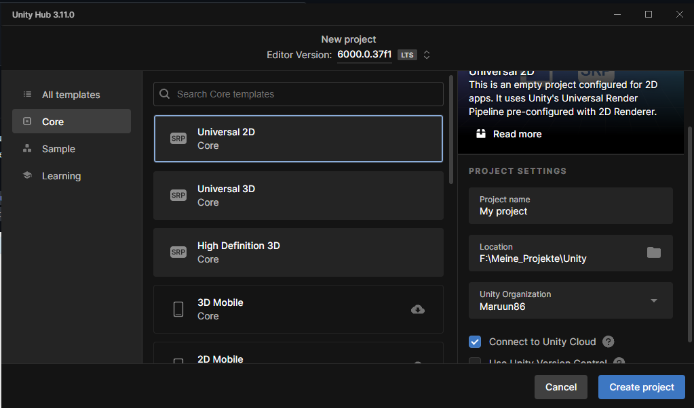
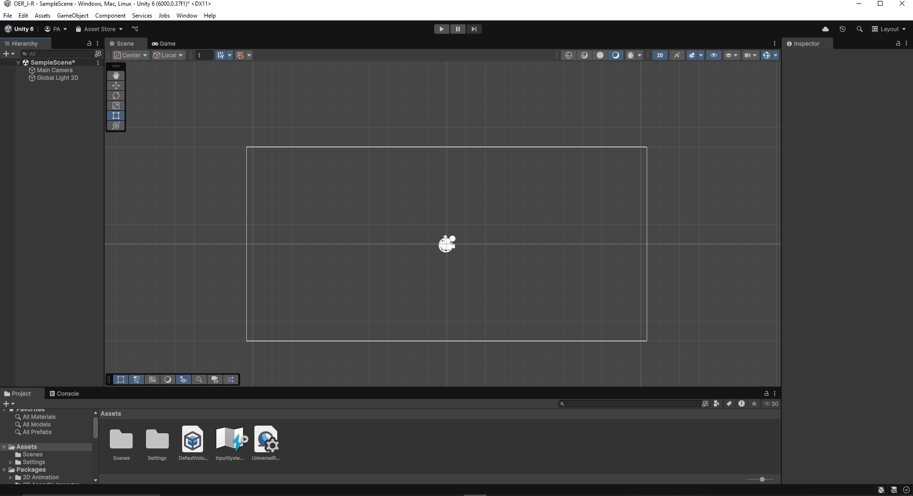

# OER - OERIA
## Einleitung
OERIA ist ein Jump&Run Projekt das im Rahmen einer OER Einführung in Unity entstanden ist. In diesem Dokument werden die einzelenen Schritte erläutert für die Erstellung eines 2D Jump&Run.
Dabei werden Themen wir Scenenerstellung, Objektplazierung, Kamera und Steuerung angesprochen.

## Inhaltsverzeichniss

- [OER - OERIA](#oer---oeria)
  - [Einleitung](#einleitung)
  - [Inhaltsverzeichniss](#inhaltsverzeichniss)
  - [Kapitel 1 - Installation von Unity und Projekt Erstellung](#kapitel-1---installation-von-unity-und-projekt-erstellung)
  - [Kapitel 2 - Unity Editor: Übersicht](#kapitel-2---unity-editor-übersicht)

## Kapitel 1 - Installation von Unity und Projekt Erstellung
Unity kann auf der [Webseite](https://unity.com/de) heruntergeladen werden. Die Installation erklärt sich von selbst.

Am Ende der Installation finden wir uns mit dem Unity Hub konfrontiert.

Hier erstellen wir unter **Projects** ein **New Project**  
Wir bennenen das Projekt Projekt und setzen den Speicherort fest.  
Mit **Create Projekt** erstellt Unity das Projekt.

## Kapitel 2 - Unity Editor: Übersicht
Willkommen im Unity Editor!

