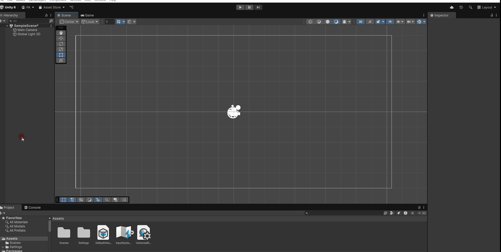

<!--
author:   Pierre Antonschmidts
email:    pierrea@web.de
version:  0.1.0
language: en
narrator: US English Female

comment:  Einfacher Kurs für Unity. Erstellung einer Scene und Einführung in Objekte und Steuerung für ein Jump & Run Scenario.
          Multiline is also okay.

link:     https://github.com/Maruun86/OER_J-R
-->

# Unity - Anfänge eines Jump&Run
Dies ist Jump&Run Projekt das im Rahmen einer OER Einführung in Unity entstanden ist. In diesem Dokument werden die einzelenen Schritte erläutert für die Erstellung eines 2D Jump&Run.  

Dabei werden Themen wir Scenenerstellung, Objektplazierung, Kamera und Steuerung angesprochen.

## Kapitel 1 - Installation von Unity und Projekt Erstellung
Unity kann auf der [Webseite](https://unity.com/de) heruntergeladen werden. Die Installation erklärt sich von selbst.

Am Ende der Installation finden wir uns mit dem Unity Hub konfrontiert.


Hier erstellen wir unter **Projects** ein **New Project**  
Wir bennenen das Projekt Projekt und setzen den Speicherort fest.  
Mit **Create Projekt** erstellt Unity das Projekt.


## Kapitel 2 - Unity Editor: Übersicht
Willkommen im Unity Editor!


Ist in mehrere Abschnitte unterteilt wir schauen uns jeden Abschnitt kurz an und erklären dir was die Aufgabe des Abschnitts ist.
Um die Erklärung zu vereinfachen haben wir die Abschnitte farblich hinterlegt.


  <p style=color:#45895a> <b>Scene:</b><br>
  Das ist unsere Scenen, unsere Hauptansicht. Hier werden Objekte positioniert und 
  ist im Grunde unser "Level Editor".
  </p>

  <p style=color:#894545> <b>Hierachy:</b><br>
  Ist eine Allgemeiner Übersicht über alle Objekte in einer Scene, Dinge wie 2D Objekte, 
  Spieler, Kamera, Licht und vieles mehr. Sie vereinfacht es Objekte zu bearbeiten.
  </p>

  <p style=color:#456c89> <b>Projekt:</b><br>
  Ist eine Übersicht unseres gesamten Projekts. Hier finden wir alle Modele, Texturen, 
  Scenen, Sounds. Alles was mit unserem Projekt im ganzen zutun hat.</p>

  <p style=color:#784589> <b>Inspector:</b><br>
  Wenn wir Objekte aus der Hierachy wählen bekommen wir hier mehr Details zu dem Objekt 
  zu sehen zudem ermöglicht der Inspector eine Reihe von Einstellungen zu einem Objekt an.
  </p>

## Kapitel 3 - Einleitung Testscenario
In den ersten Schritten beschäftigen wir uns mit der Erstellung eines Testscenarios. Am Ende von Kapitel 3
haben wir ein simples Leveldesign, einen Spielcharakter sowie die Möglichkeit den Charakter zu bewegen.

Für den Anfang brauchen wir erstmal etwas aufdem wir stehen können. Dafür werden wir eine 
2D Object nutzen in Form eines Quadrats. Das wird in der Scene positioniert und etwas 
über den Kamerarand hinaus gestreckt.

Um das **Square* zu erstellen Rechtsklicken wir auf die **Hierachy** wählen **2D Object**
->**Sprites**->**Square** aus. Dadurch wird ein neues **Square** erstellt und 
auf der **Scene** plaziert.

Dann können wir uns das ganze in der Vorschau anschauen. Indem wir auf den **Play** Button 
über dem **Scene**  drücken.



Wir finden nun unser **Square** in der **Hierachy** auf der linken Seite und bennen es um wir 
haben es in diesem Fall einfach **Ground** genannt.

Zu unserem **Ground** fügen wir noch ein **Circle** ein der unser **Spieler** sein wird.
Wenn wir unseren **Spieler** auswählen sehen wir im **Inspector** die Eigenschaften dieser Klasse
dort stellen wir den **Tag** auf **Player**.


Für die Übersicht können wir die **Objecte** in der **Scene** verstecken und sperren damit
wir **Objecte** nicht versehnlich bewegen. Dafür finden wir in der **Hierachy** links neben den
**Objecte** die zwei Buttons.


Hiermit verstecken wir die **MainCamera**, **Global Light 2D** und sperren **Ground**.

### Kapitel 3.1 - Levelphysik

Mit diesem Schritt beschäftigen wir uns mit Unitys Physikengine. Dafür müssen wir **Objects** als
physikalische Objekte kennzeichnen. Dies wird mit Hilfe von **Components** an **Objects** 
durchgeführt. In unserem Fall müssen wir unsern **Objects**, **Ground** und **Player** 
die **Component**: **Rigidbody 2D** hinzufügen mit Hilfe des **Inspectors**.

Wir drücken **Add Component** wählen **Physics 2D** und **Rigidbody 2D** bei **Ground** ist
wichtig den **Body Type** auf **Static** zu stellen.


---
> **Erläuterung: Body Type : Static**  
>**Body Type** legt im Grunde fest wie das Objekt simuliert wird. **Static** sagt aus es ist Teil
>der Simulation aber eine absolut unbewegliche Masse.  
>Für mehr Informationen ein
>[Link zur offiziellen Dokumentation](https://docs.unity3d.com/6000.0/Documentation/Manual/2d-physics/rigidbody/body-types/static/static-body-type-reference.html)
---

In der Vorschau werden wir nun sehen wie der **Player** von der Gravitation
nach unten gezogen wird und durch unseren **Ground** fällt.  
Um das zu vermeiden müssen wir beiden **Objects**
einen **Collider** als **Component** geben.
Für den **Player** nehmen wir einen **Circle Collider 2D** und für den **Ground** nehmen wir
einen **Box Collider 2D** beides unter **Physics 2D** zufinden.

### Kapitel 3.2 - Steuerung

An diesem Punkt werden wir die **Player** Steuerung implementieren. Dafür nutzne wir das neue **Input System Package** von Unity. Es gibt uns die flexibilität und vereinfacht das erweitern der Steuerung enorm.

Dafür schauen wir uns das **Input System Package** genauer an.
Über **Edit**-> **Project Settings** finden wir das **Input System Package**.


Hier finden wir schon zwei vorgefertigte **Action Maps** das Input System arbeitet mit **Actions** die wir aufgreifen. Beispielsweise wenn wir die WASD Tasten drücken.
soll sich der Character bewegen.

Wir erstellen hier unser eigene **Action Maps** um den Ablauf zu erklären und es für uns erstmal einfacher zu machen.

Wir nennen die neue **Action Map** "Jump&Run" und stetzen den **Action Type** auf **Pass Through** sowie den **Control Type** auf **Vector 2** und bennen unsere "New action" zu "Move"


Unsere "Move" **Action** wir fügen wir ein **Binding** hinzu und zwar eine **Up/Down/Left/Rifgt Composit** und nenne sie "WASD". Die "Up" entfernen wir dazu kommen wir später. 

Dann legen wir die Tasten fest für jedes **Binding** über den **Path** mit **Listen** können wir einfach eine Taste drücken um das zuweisen zu vereinfachen. Zuletzt müssen wir noch ein Häckschen in "Keyboard&Mouse" für alle drei Tasten machen um das **control scheme** festzulegen.


Zum Abschluss müssen wir den Input Manager nur noch als **Component** dem **Player** zuweisen.


Wichtig: Wir müssen die **Default Map** auf "Jump&Run" stellen!
Weil wir mehrere **Actions Map** haben.

Nun kommen wir zum endspurt. Wir müssen nun festlegen was passieren soll wenn unsere 
Aktionen ausgelösst werden dafür brauchen wir unser erstes kleines Script.

Wir erstellen ein nues Script mit im unerem **Assets** Fenster. Rechtsclick->*Create*->*Scripting*->*MonoBehavior Script* und nennen es **PlayerControlScript**

Das öffnen wir mit unserem Editor des vertrauens.


Hier werden wir ein paar änderungen vornehmen. Vorweg wir benennen die Klasse um. Von **MonoBehaviourScript** zu **PlayerControlScript**.

Wir erläutern nun erstmal was wir genau in diesem Script reinschreiben.
Im großen ganzen werden Bewegungen von Objekten mit der PhysikEngine vorgenommen. 

Dafür brauchen wir ein Verweis auf das **Rigidbody2D** *rb*. Wir setzen uns einen float für die Bewegungsgeschwindigkeit in diesem Fall **movespeed** und Sprungstärke mit **jumpForce**.  

Dann brauchen wir einen Vector2 für die Bewegungsrichtung **_moveDirection**.
Am wichtigsten sind die beiden **InputActionReference** *move* und *jump*
hierüber können wir unseren Input auslesen

In der **Update** Funktion lesen wir den Wert unserer *move*-Aktion raus.
Das wird unsere Begegungsrichtung in Form eines **Vector2**.

im **FixedUpdate** benutzen wir unsere Bewegungsrichtung * Bewegungsgeschwindigkeit um einen linearen Vector für unseren Spieler zu geben das sich in Bewegungs auswirkt.

Kurze Erklärung zum unterschied zwischen **Update** und **FixedUpdate**.

**Update** wird mit jedem Frame durchgeführt wärend **FixedUpdate** einen Intervall folgt die dem Physiksystem entspricht und hat einen festen Zeitpunkt innerhalb eines Frames und läuft unabhängig von normalen **Update**.

Am Ende sieht unsere PlayerControlScript wie folgt aus.

```csharp
  using System.Runtime.CompilerServices;
  using UnityEngine;
  using UnityEngine.InputSystem;

  public class PlayerControlScript : MonoBehaviour
  {
      public Rigidbody2D rb;

      public float moveSpeed;
      public float jumpForce = 10f;

      private Vector2 _moveDiretion;

      private float _airSpeed;
      public InputActionReference move;
      public InputActionReference jump;

      bool isGrounded() { return rb.linearVelocity.y == 0;}
      bool isJumping () { return jump.action.inProgress;}

      // Update is called once per frame
      void Update()
      {  
          _moveDiretion = move.action.ReadValue<Vector2>();
          
        if (isGrounded())
        {

          if (isJumping())
          {
              rb.AddForceY(jumpForce, ForceMode2D.Impulse);
              
              _airSpeed = rb.linearVelocityX;
              _moveDiretion.x = _airSpeed;    
          }
        }
      }
      void FixedUpdate()
      {
        if (isGrounded())
        {
          rb.linearVelocity = new Vector2(x: _moveDiretion.x * moveSpeed, y: rb.linearVelocityY);
        }else
        {
          rb.linearVelocity = new Vector2(x: rb.linearVelocityX, y: rb.linearVelocityY);
        }
      }
     
```
Dies ist nur ein Beispiel ist nicht "Best in Case" probiert es selbst aus bis ihr zufrieden seit mit der Bewegung.

Doch bevor sich irgendetwas bewegt müssen wir unser Script auch dem Player zuweisen.
Dafür nutzen wir wieder **Add Component** -> **Scripts** und dort müssten wir unser PlayerControlScript finden.

Zudem werdet ihr festellen das alle *public* Variablen in der *Component* wiederzufinden sind. 


Wir wählen für *rb* den **RigiidBody2d** unsere Spielers aus. Setzen das gewünschte *movespeed* und *jumpForce* zum Abschluss müssen wir die Jump&Run/Move zu **Move** zuweisen und die Jump&Run/Jump für **Jump**.

Das ist unsere Inputverbindung zur **ActionMap**.

## Abschluss


Damit haben wir das Ziel für dieses kleine OER erreicht.
